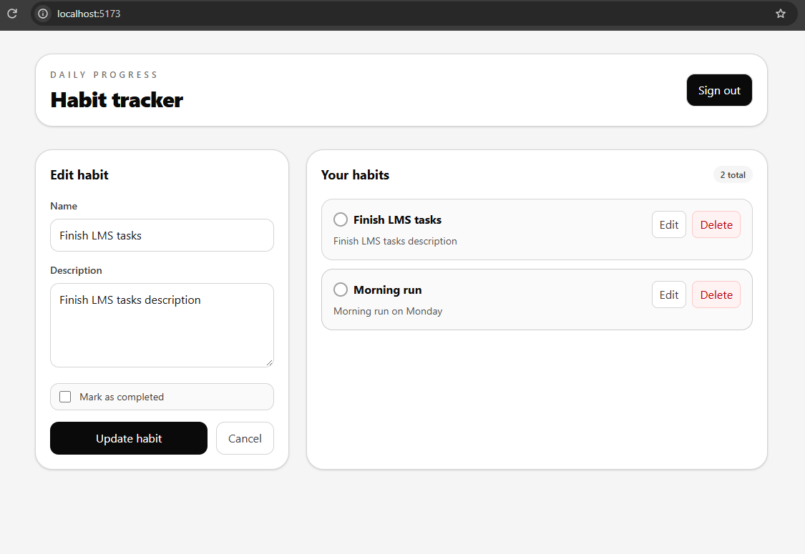
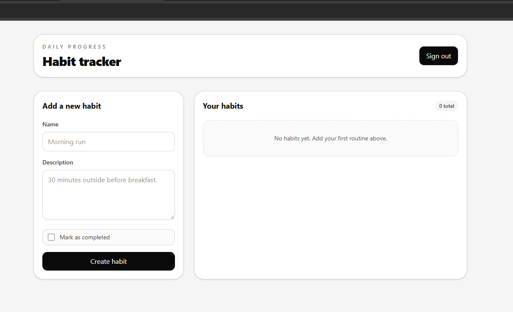
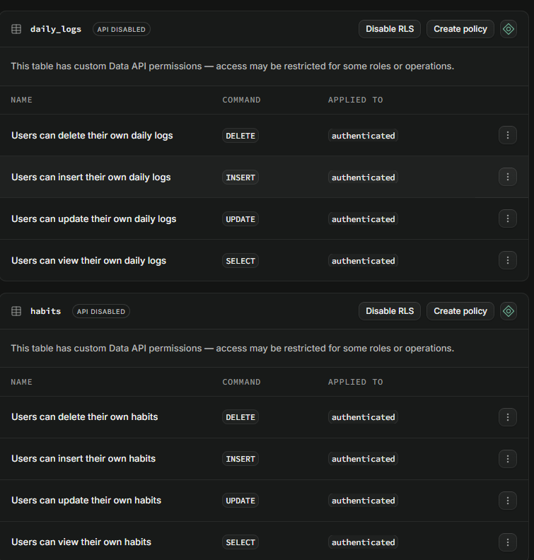
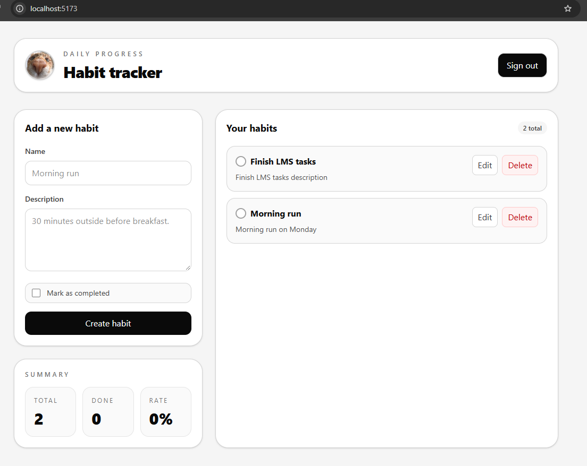
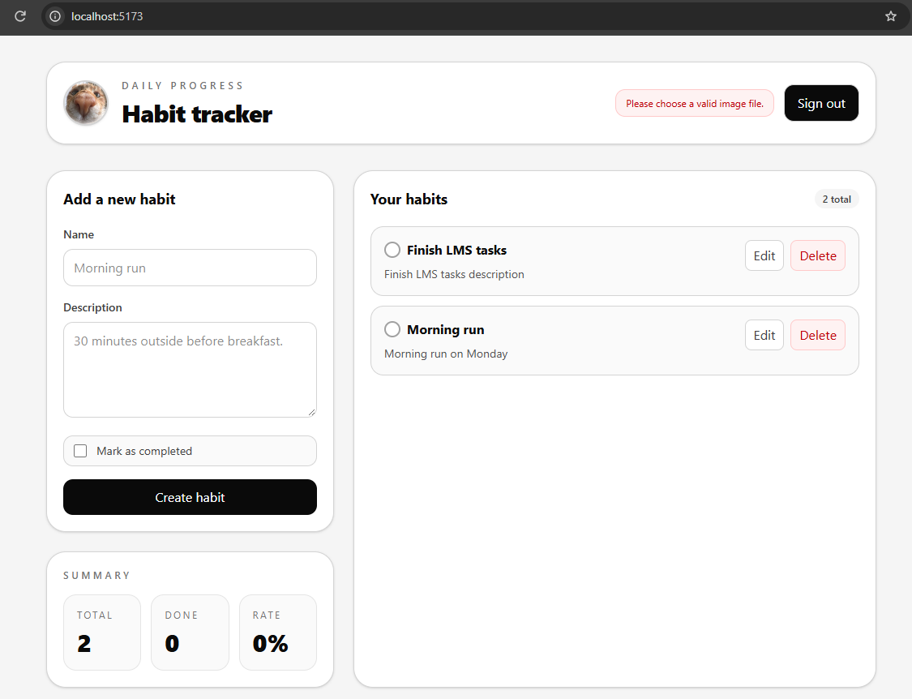
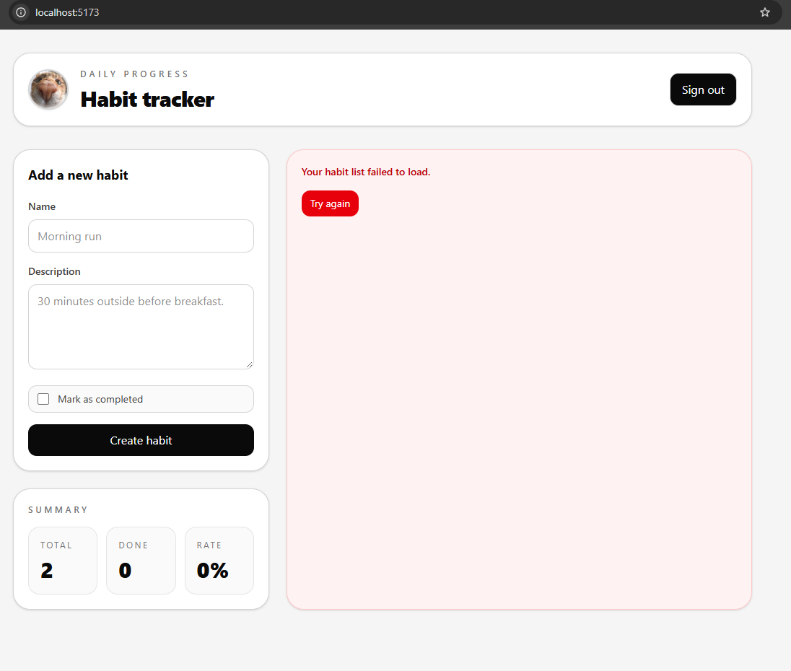

# Habit Tracker

A small habit-tracking app built with React, Vite, Tailwind CSS, and Supabase. The app lets each signed-in user manage their own habits safely with auth protection, row-level security, and a personal avatar upload flow.

## What this project does

- User sign-up and sign-in with Supabase Auth
- Protected routes so unauthenticated users are redirected to /login
- CRUD operations for habits using fetch instead of axios
- Personal avatar upload and persistent profile image storage
- Client-side validation for image uploads: only image files, max size 1 MB
- Public `avatars` bucket with per-user folder restriction using `auth.uid()`
- Reusable `ErrorBoundary` class components around main sections to isolate crashes
- Simple black-and-white UI styling with Tailwind
- User-specific access patterns so one account cannot see another account's habits

## Project structure

```text
src/
  components/
    AuthPage.tsx
    HabitTracker.tsx
    ProtectedRoute.tsx
    ErrorBoundary.tsx
  lib/
    supabase.ts
  types.ts
  App.tsx
  index.css
.env
.env.example
supabase-schema.sql
```

## Setup

1. Copy `.env.example` to `.env`
2. Add your Supabase values:
   - `VITE_SUPABASE_URL`
   - `VITE_SUPABASE_ANON_KEY`
3. Run the SQL from `supabase-schema.sql` inside your Supabase SQL editor
4. Start the app:

```bash
npm install
npm run dev
```

## Avatar upload flow

The app supports a secure avatar upload flow:

1. User clicks the profile avatar area and selects an image file.
2. The file is validated on the client:
   - must be an image (`image/*`)
   - must be 1 MB or smaller
3. The file is uploaded to the public `avatars` bucket using `upsert: true`.
4. The uploaded file path is saved to `public.profiles.avatar_url` for the current user.
5. On refresh, the app reads the saved URL from the `profiles` table and renders it again.

The upload path is scoped to a per-user folder such as:

```text
avatars/{auth.uid()}/avatar
```

This prevents users from uploading into someone else's folder.

## Storage and database security

The SQL in `supabase-schema.sql` creates:

- a `public.profiles` table with a user-owned profile row
- a trigger to create a default profile row for each new auth user
- RLS policies that allow each user to view/update only their own profile
- a public `avatars` bucket
- storage policies that ensure each user can only work inside their own folder with `auth.uid()`

The key security idea is that frontend validation is UX, but storage/database policy is the real protection.

## Error boundaries

Major UI areas are wrapped with a reusable `ErrorBoundary` component to keep a broken section isolated while the rest of the page remains usable.

- Header / navigation
- Habit form
- Stats panel
- Habit list

Each boundary shows a fallback UI with a `Try again` button.

## Notes

This app is intentionally designed around per-user security. Every habit query, mutation, profile fetch, and avatar operation is scoped to the logged-in user, and the Supabase RLS policies enforce that at the database level.

## Screenshot of Supabase Fundamental Task

### Signed-in account → habit list



### Second account → empty habit list



### SQL Editor → both policies



## Screenshot of Media and Resilince Task

### Avatar Preview State



### Rejected File Message



### Avatar Rendered on Fresh Load


### Error Boundary in Action



### One Sentence

1. Without RLS, an attacker could potentially access, modify, or delete other users’ habits or profile data by bypassing the app’s frontend restrictions.

2. Client-side validation improves UX with instant feedback, while the storage policy provides security by restricting who can upload files.
