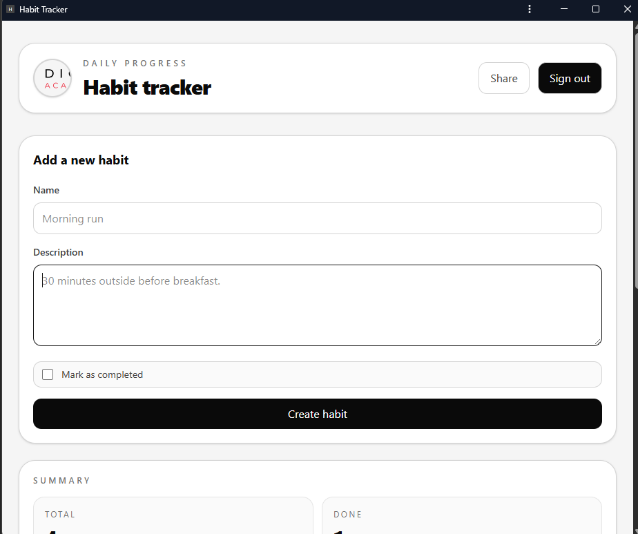
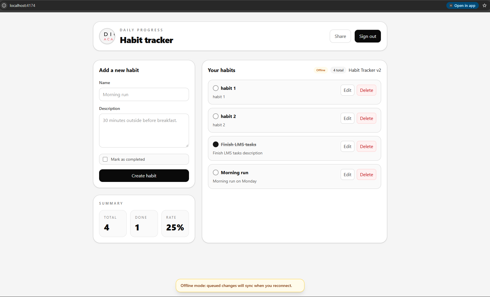
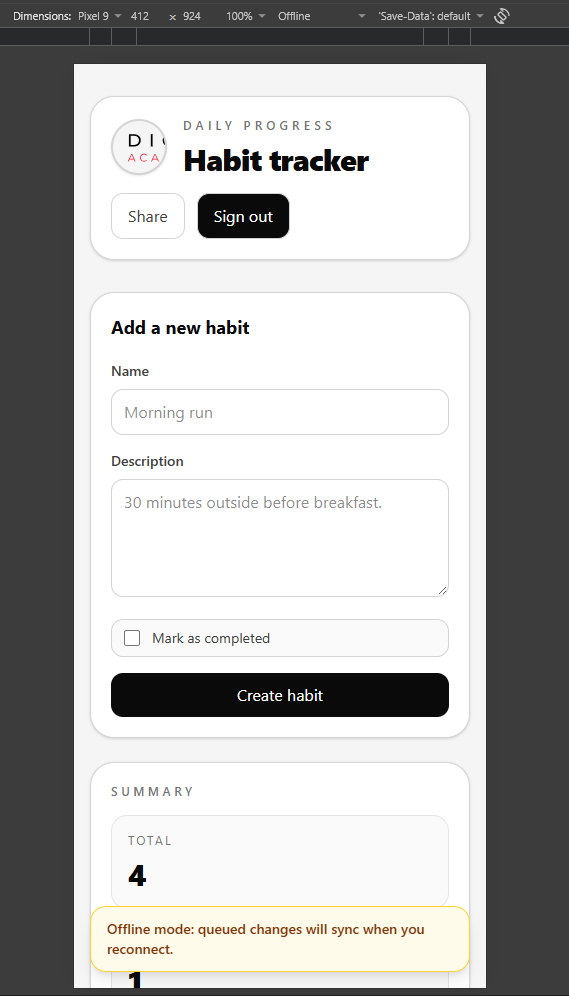
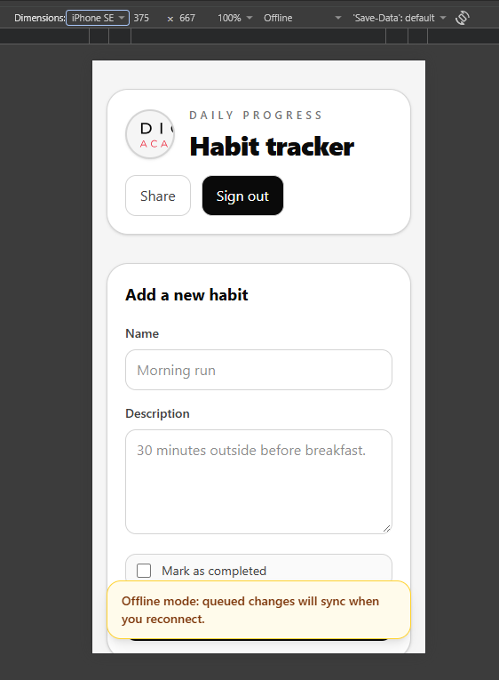
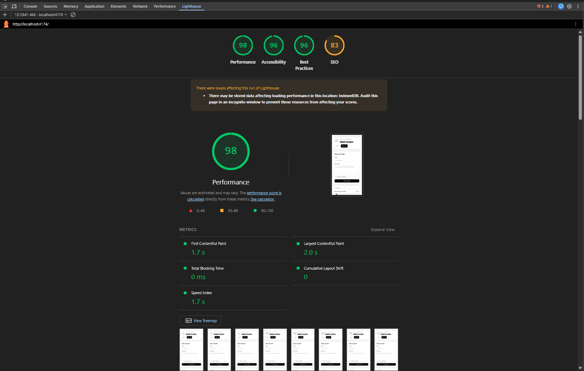

# Project Progress Update

We recently finished the app’s PWA and offline-first improvements for the habit tracker.

## What was updated

- Added Vite PWA configuration with a prompt-based update flow and refresh toast.
- Enabled installability support with bundled web app manifest metadata.
- Added an online/offline status banner and queued habit syncing when the connection is restored.
- Improved the mobile-first layout to prevent horizontal overflow and keep content readable on small screens.
- Added a share action with clipboard fallback for supported browsers.
- Kept the production build checked with the preview flow to verify the app works as a packaged build rather than in dev mode.

## Notes

This work focuses on making the app behave more like a real installable mobile app: reliable offline behavior, better small-screen layout, and reliable update flow for users after new versions are deployed.

## Screenshot

### Installed app

### Offline

### Pixel Responsive

### SE Responsive

### Lighthouse score

- Caching rule:
  . App shell — Precache: It must load offline so users can open the app without a network connection.
  . Images — Cache First: Images change rarely, so reusing the cached copy makes them load faster.
  . API data — Network First: Habit data should be fresh, but cached data can be used when the network is unavailable.
